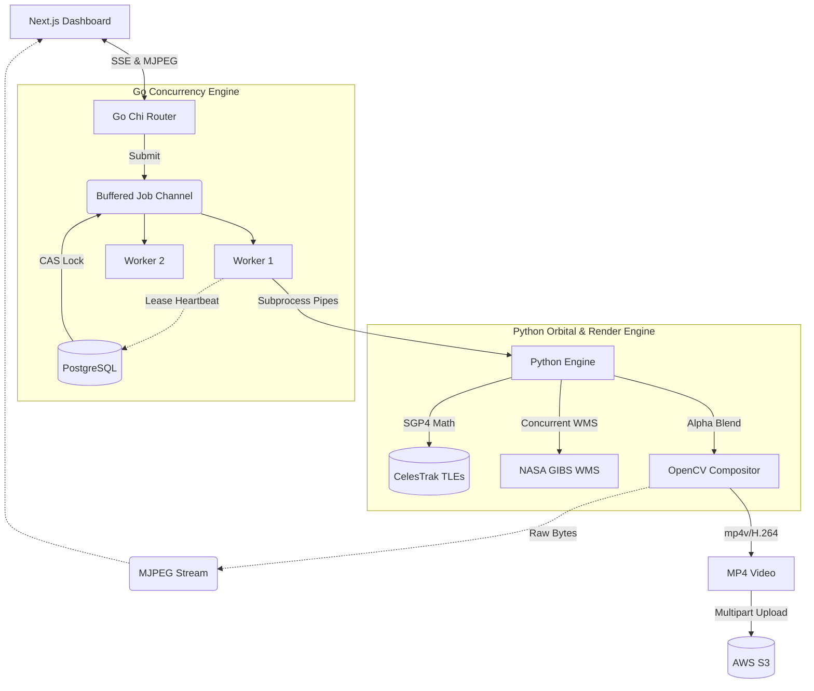

# 🌍 GeoStream — Orbital Intelligence Backend

> **Distributed Go + Python backend for real-time satellite tracking, WMS imagery compositing, and asynchronous geospatial video rendering.**

[](https://golang.org/)
[](https://python.org/)
[](https://postgresql.org/)
[](https://aws.amazon.com/s3/)
[](https://www.docker.com/)
[](LICENSE)

> **Frontend repo:** [geostream-frontend](https://github.com/your-username/geostream-frontend)

---

## 💡 Why This Project Matters

GeoStream solves severe, real-world distributed systems problems:
- **Unbounded workload safety** — Go worker pools with bounded channels prevent OOM crashes under surges.
- **Massive I/O-bound concurrency** — Python `ThreadPoolExecutor` pulls 4K NASA tiles in parallel.
- **Dual-protocol streaming** — MJPEG `<200ms` live orbital tracking vs. async H.264 batch rendering via SSE.

---

## 🏗️ Architecture



---

## ⚙️ System Design Depth

### 1. Concurrency & At-Least-Once Delivery
- **Optimistic CAS Locking** via PostgreSQL `UPDATE WHERE status='PENDING'`. Workers compete for jobs atomically using Compare-And-Swap versioning, allowing multiple distributed nodes to pull from the queue safely with zero risk of duplicate processing. No Redis needed.
- **Bounded Worker Pools** — Go channel `queueSize` hard-caps memory pressure. Returns `HTTP 503` on saturation (backpressure) instead of crashing.

### 2. Fault Tolerance & Crash Recovery
- **Lease Heartbeats** — Background goroutine continuously extends a PostgreSQL `lease_expiry` while Python is rendering. 
- **Dead-Letter Sweeper** — Periodic goroutine reclaims expired leases from crashed workers and re-queues jobs. Zero data loss on node failure.

### 3. SGP4 Orbital Mechanics
- Fetches live **Two-Line Element (TLE)** sets from CelesTrak for 18 tracked satellites (including ISS, Terra, Aqua, and Tiangong).
- Uses `sgp4` library to propagate Keplerian orbital elements in real-time, computing sub-second accurate positions.
- **Clamp-and-Shift BBOX Algorithm** — Prevents WMS image warping at the International Date Line and poles by shifting the viewing box instead of clamping it.

### 4. NASA WMS Pipeline
- Covers 60 WMS Satellite Layers — MODIS True Color, VIIRS Night Lights, Thermal Anomalies, NDVI, Sea Surface Temp, Bathymetry, NEXRAD Radar, and more.
- **Activity detection** uses alpha-channel pixel analysis (threshold=3) to distinguish real nighttime city lights from empty tiles.
- **Date auto-scan** — Searches backwards from the event date up to 7 days to find the latest frame with valid imagery, respecting NASA GIBS's 48-hour processing latency.

---

## 📊 Load Test Results

Stress-tested with **k6** at 50 RPS sustained:

```
http_req_duration: avg=4.58ms  p(95)=11.04ms
http_reqs:         1002        79.70/s
Server Crashes:    0           (OOM prevented by bounded channel)
```
- `HTTP 503` correctly enforced on queue saturation (backpressure)
- `HTTP 409` correctly returned for duplicate SHA-256 job hashes (idempotency)

---

## 🚀 Local Setup

### Prerequisites
- Go 1.22+
- Python 3.10+
- PostgreSQL 15+
- Docker (optional, for DB)

### Quick Start

```bash
# 1. Clone
git clone https://github.com/your-username/geostream-backend.git
cd geostream-backend

# 2. Configure environment
cp .env.example .env
# Edit .env — set DATABASE_URL and JWT_SECRET at minimum

# 3. Install Python deps
pip install opencv-python-headless numpy requests sgp4

# 4. Run database migrations
# (use golang-migrate or psql directly)
psql $DATABASE_URL -f migrations/000001_init_schema.up.sql
psql $DATABASE_URL -f migrations/000002_add_wms_layers.up.sql
psql $DATABASE_URL -f migrations/000003_add_time_step.up.sql

# 5. Run server
go run cmd/server/main.go
```

API available at `http://localhost:8080`  
Swagger UI: `http://localhost:8080/swagger/index.html`

### Docker

```bash
docker build -t geostream-backend .
docker run -p 8080:8080 --env-file .env geostream-backend
```

---

## 📡 API Reference

| Method | Endpoint | Auth | Description |
|--------|----------|------|-------------|
| POST | `/api/auth/register` | ❌ | Register new user |
| POST | `/api/auth/login` | ❌ | Login, receive JWT |
| POST | `/api/jobs` | ✅ | Submit video generation job |
| GET | `/api/jobs` | ✅ | List your jobs |
| GET | `/api/jobs/{id}` | ✅ | Get job status |
| DELETE | `/api/jobs/{id}` | ✅ | Cancel & delete job |
| GET | `/api/jobs/progress/stream` | ✅ | SSE progress stream |
| GET | `/api/stream/live` | ✅ | MJPEG live orbital stream |
| GET | `/health/live` | ❌ | Health check |
| GET | `/health/metrics` | ❌ | Queue depth & throughput |

---

## 🧪 Audit & Health Check Scripts

```bash
# Verify all 39+ NASA WMS layers + 15 satellite TLEs
python scripts/audit_wms.py

# Deep test — India (16 layers) + USA (14 layers) + video + live stream
python scripts/audit_deep.py

# End-to-end pipeline test (video gen + orbital tracking + live stream)
python scripts/test_pipeline.py
```

---

## 🛠️ Environment Variables

| Variable | Required | Description |
|----------|----------|-------------|
| `PORT` | No | Server port (default: `8080`) |
| `DATABASE_URL` | **Yes** | PostgreSQL connection string |
| `JWT_SECRET` | **Yes** | Random secret for JWT signing |
| `WORKER_COUNT` | No | Worker goroutines (default: `5`) |
| `QUEUE_SIZE` | No | Job queue capacity (default: `100`) |
| `CORS_ORIGIN` | No | Frontend URL for CORS |
| `AWS_REGION` | No | AWS region for S3 |
| `S3_BUCKET` | No | S3 bucket (leave empty for local storage) |
| `AWS_ACCESS_KEY_ID` | No | AWS credentials |
| `AWS_SECRET_ACCESS_KEY` | No | AWS credentials |

---

## 📜 License
Copyright 2026 Kushan J  
Licensed under the **Apache License 2.0** — see [`LICENSE`](LICENSE) and [`NOTICE`](NOTICE) for third-party attributions.
